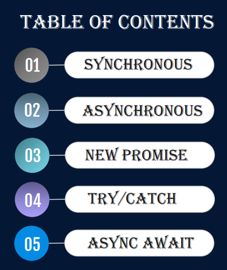
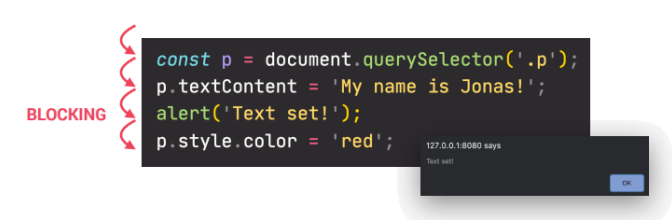
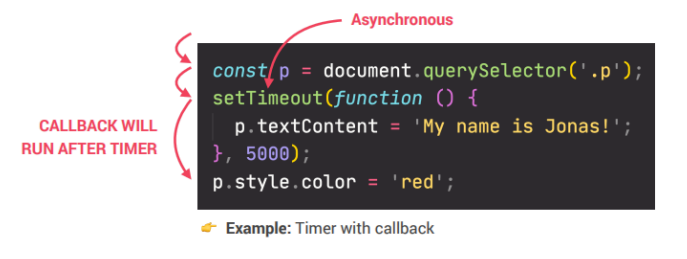
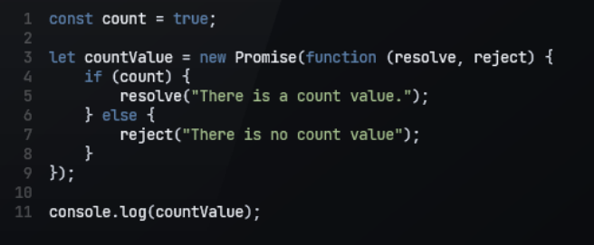
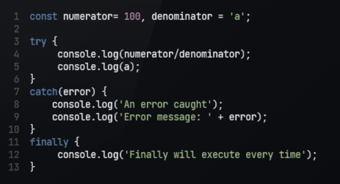

***

>## SYNCHRONOUS
>>### SYNCHRONOUS коды читаются по порядку.

***

>## ASYNCHRONOUS
>>### ASYNCHRONOUS коды ждет когда не выполнться все SYNCHRONOUS коды. можно задать время, то есть сработает через определенное время. 

***

>## New PROMISE IN JAVASCRIPT
>### Promise может находиться в трёх состояниях: 
>### ожидание (pending):
>### начальное состояние, не исполнен и не отклонён. исполнено (fulfilled): операция завершена успешно. 
>### отклонено (rejected): операция завершена с ошибкой.

***

>## синтаксис PROMISE

***

>## TRY / CATCH / finally
>### TRY / CATCH / finally рвботает как (IF, ELSE) try выполнится если условия "TRUE" catch когда "FALSE"

***

>## AWAIT
>### Оператор await используется для ожидания окончания Promise. Может быть использован только внутри async function или на верхнем уровне.--Ждет когда звгрузить все нужные файлы потом покажет нам.

***

>## API--«Application Programming Interface»
>### Что значит API? API – Application Programming Interface, что значит программный интерфейс приложения. В контексте API слово «приложение» относится к любому ПО с определенной функцией. Интерфейс можно рассматривать как сервисный контракт между двумя приложениями.
>### С помощью этого промежуточного слоя системы обмениваются данными и выполняют различные функции.

***

>## REST (Representational State Transfer)
>### REST (Representational State Transfer) — это способ создания API с помощью протокола HTTP. На русском его называют «передачей состояния представления». Технологию REST API применяют везде, где пользователю сайта или веб-приложения нужно предоставить данные с сервера.

***

>## Fetch()
>### Fetch API предоставляет интерфейс JavaScript для работы с запросами и ответами HTTP. Он также предоставляет глобальный метод fetch() (en-US), который позволяет легко и логично получать ресурсы по сети асинхрониний
